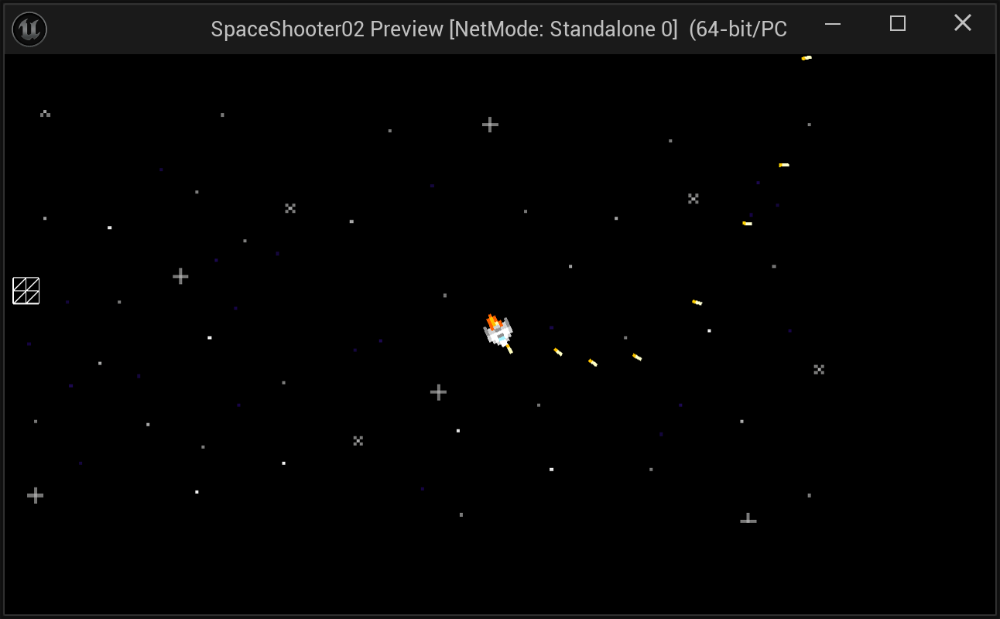
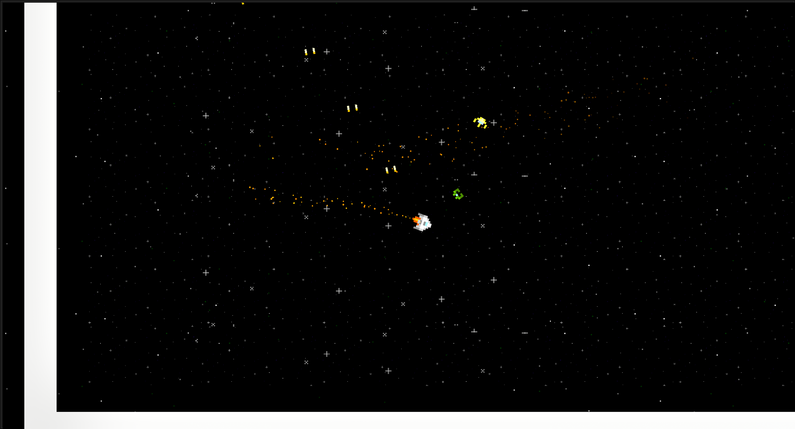
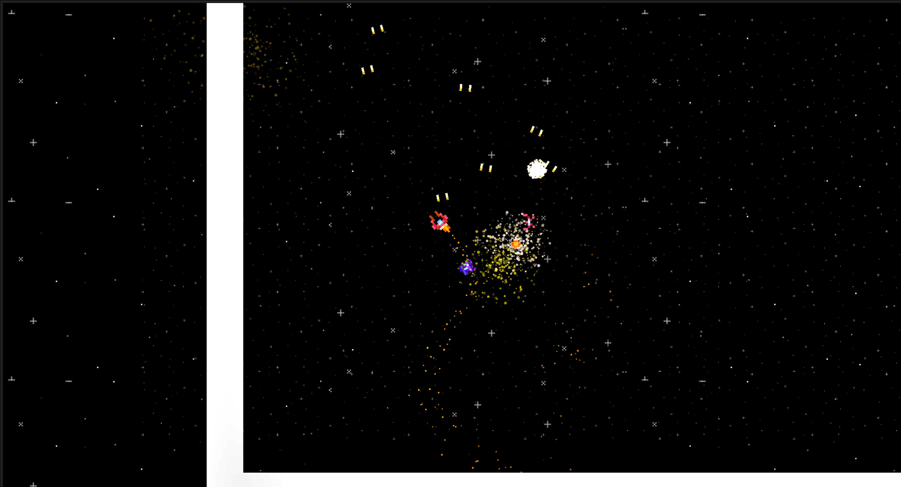
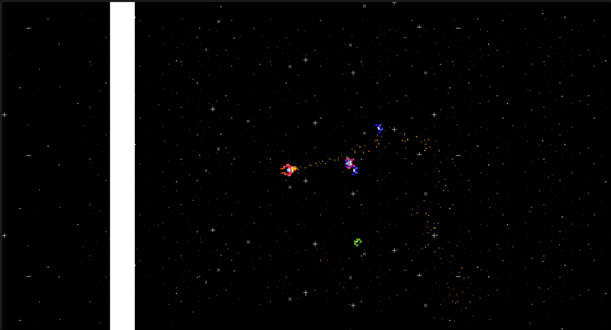
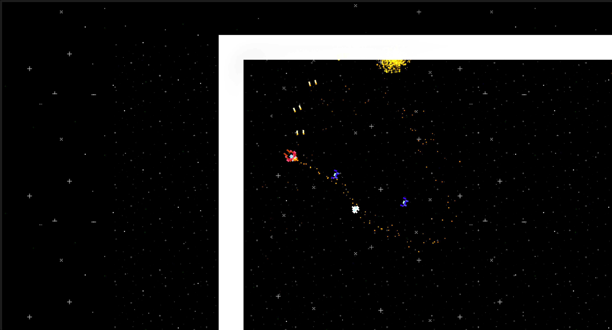

# GENERIC SPACE SHOOTER
 2D Twin Stick Shooter built harnessing the power of **Unreal Engine 5**!!!

 Lately, I've been doing a bit of research with 2D development with Unreal Engine, so I decided to rebuild this project in UE5 that I previously built in Unity:  
 https://github.com/RSkala/SpaceShooter01

 2D Game Development is not very well documented, so I decided to challenge myself to make a 2D game... also I love 2D games!

 As I develop this game, I will update this document with various notes:
 https://github.com/RSkala/SpaceShooter02/blob/main/Documents/SpaceShooter02-DevNotes.txt

 

Very early Work-In-Progress Screenshots:  

<!--

-->

  

  

  

 

#
